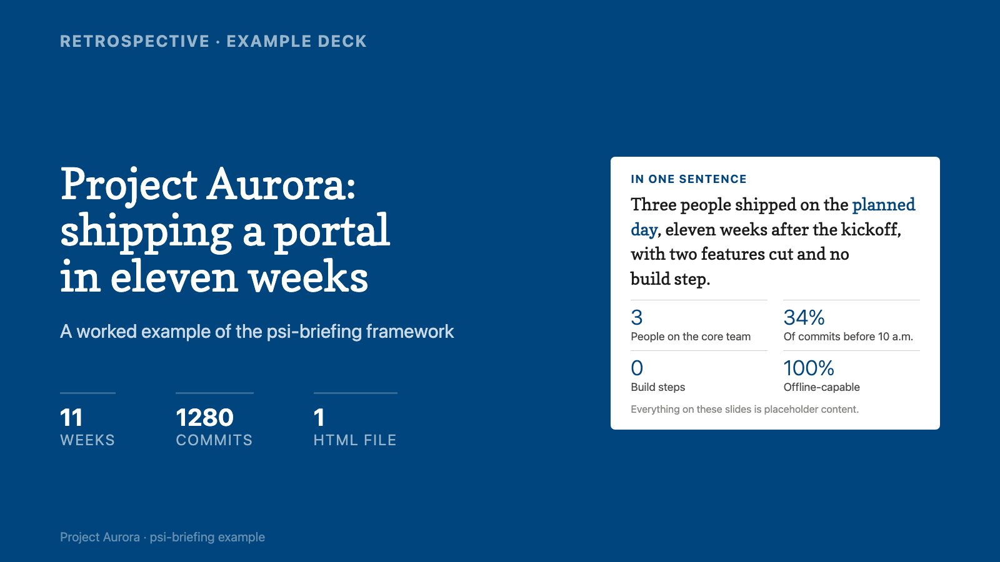

# psi-briefing

**A generator for briefing decks. Write one Markdown file, run one command, and get text-dense 16:9 slides in a single self-contained HTML file.**

```bash
node tools/md-to-deck.mjs deck.md -o deck.html
```

The output is dense enough to read without anyone presenting it, because a briefing is what you send to the people who could not attend. No dependencies, no build step, no server, no fonts to install. Open the file on a 13″ laptop, a 4K projector or a phone in landscape and it looks the same everywhere, because nothing inside it is measured in pixels.

*Made by [Dominik Herrmann](https://herdom.net) at the [Chair of Privacy and Security in Information Systems](https://psi.uni-bamberg.de/), University of Bamberg · [MIT-licensed](LICENSE) · [Deutsche Kurzfassung unten ↓](#deutsch)*

**[Look at it first →](https://uba-psi.github.io/psi-briefing/)** · open the
[example deck](https://uba-psi.github.io/psi-briefing/example-deck.html) or the
[tutorial deck](https://uba-psi.github.io/psi-briefing/tutorial.html). Both are one
HTML file each: save either and it still opens with the network unplugged.



> **Slides for a talk you will actually deliver?** That is the sibling project,
> [**psi-slides**](https://github.com/UBA-PSI/psi-slides): one Markdown source
> producing a projection, a presenter cockpit, a reading document and a handout.
> The line between the two is whether anyone is speaking – psi-slides is for the
> lecture, psi-briefing for the document that has to work without you in the room.

---

## Why it looks the way it does

Two ideas do all the work:

1. **Container-query scaling.** Every slide is a `16:9` box with `container-type:size`. Everything inside it – text, spacing, charts, everything – is measured in container-query units (`cqw` = 1 % of slide width, `cqh` = 1 % of slide height), never in `px` or `rem`. So the whole layout scales *proportionally* with the slide. Every gap and every type size keeps its proportion, which is what makes a deck hold together on a laptop and a 4K projector at once.

2. **Semantic design tokens.** Every colour and font is a CSS custom property with a semantic name (`--accent`, `--ink`, `--highlight`, `--font-display`…). A *theme* is nothing but a `:root { … }` block that overrides those tokens. Re-skinning the entire deck – including the generated SVG charts, which read the tokens at draw time – is a one-file change.

The JavaScript runtime is deliberately small and dumb: it reads declarative markup and config, and generates nav dots, page numbers, SVG bar charts, hover-preview cross-references, detail layers, and lightboxes at runtime. Zero dependencies.

## Quickstart

```bash
git clone https://github.com/UBA-PSI/psi-briefing.git
cd psi-briefing
python3 -m http.server 8000
# open http://localhost:8000/examples/example-deck.html
```

A minimal deck is three things – link the framework, add slides, add the chrome.
The three `href`/`src` paths below are written for a deck sitting **at the root of
the repository**; every deck in `examples/` is one level down and links
`../framework/briefing.css` instead. Getting this wrong is the usual reason a new
deck opens completely unstyled.

```html
<!DOCTYPE html>
<html lang="en"><head>
  <meta charset="utf-8">
  <meta name="viewport" content="width=device-width, initial-scale=1">
  <title>My deck</title>
  <link rel="stylesheet" href="framework/briefing.css">
  <link rel="stylesheet" href="themes/bamberg.css">   <!-- swap to re-skin -->
</head><body>

  <section class="frame"><div class="slide slide--title"><div class="slide-inner">
    <p class="eyebrow">My talk</p>
    <h1>A headline that scales to any screen</h1>
    <div class="pagefoot"><span>Footer</span><span class="pagenum"></span></div>
  </div></div></section>

  <!-- more <section class="frame">…</section> slides -->

  <nav class="dots" aria-label="Slide navigation"></nav>
  <div class="hint">↓ scroll · → next</div>
  <script src="framework/briefing.js"></script>
</body></html>
```

Navigate with arrow keys, space, PageUp/Down, Home/End, the scroll wheel, or the nav dots.

### Or write it as Markdown

Picking components out of a catalog is the slow part. `md-to-deck.mjs` reads the
*shape* of a document instead and chooses for you:

```markdown
## Four roles on an exam

### Candidates
They sit the exam at laptops.

### Examiner
Responsible for the exam, and provides all the printed material.

### Invigilators
They invigilate, and help set up and pack down.

### Technical lead
Knows the system in detail. Explicitly **not** an invigilator.

> Who leads is settled **before** the exam day.
```

Four `###` blocks become a bordered 2×2 grid; the blockquote becomes the
highlighted band at the bottom of the slide.

```bash
node tools/md-to-deck.mjs deck.md -o deck.html
```

The output is the same deck HTML you would write by hand, so you can hand-tune any slide
afterwards. See [`docs/markdown.md`](docs/markdown.md).

## What's in the box

| Path | What it is |
|------|-----------|
| `framework/briefing.css` | The core: slide engine, type scale, 33 layout components, deck chrome. Ships a neutral default theme. |
| `framework/briefing.js` | The runtime: navigation, page numbers, `Briefing.barChart()`, detail layers, cross-reference previews, lightboxes, image stacks. |
| `themes/bamberg.css` | The original University of Bamberg blue/yellow palette. |
| `themes/midnight.css` | A dark theme – proof that flipping `--paper`/`--ink` re-skins everything. |
| `examples/example-deck.html` | A 14-slide worked example exercising every major layout. |
| `examples/example-deck.md` | The same idea written as a Markdown document, for `md-to-deck.mjs`. |
| `examples/tutorial.md` | A tutorial deck that teaches the format by being written in it: eleven of its seventeen slides show the Markdown beside the layout it produced. |
| `tools/md-to-deck.mjs` | **Write a deck as Markdown.** Infers the component from the shape of the content: three `###` blocks become three columns, four become a bordered grid, a blockquote becomes the closing band. Outputs the same deck HTML you would write by hand. |
| `docs/markdown.md` | The Markdown authoring reference: document structure, the shape→component table, directives, and what the converter will and will not correct. |
| `docs/cookbook.md` | The component catalog – copy-paste snippets for every layout. |
| `docs/comparison.md` | How it compares to iA Presenter, reveal.js, Marp, Slidev, Beamer and PowerPoint/Keynote, plus shorter notes on several others – written in both directions, naming the case where each one is the better choice. |
| `CONTRIBUTING.md` | Conventions that are not obvious from the code: no px inside a slide, no hard-coded grid tracks, no dependencies, and why comments here explain the failure they prevent. |
| `docs/tutorial.en.md` · `docs/tutorial.de.md` | Build-your-first-deck walkthrough, bilingual. |
| `tools/embed-fonts.mjs` · `tools/inline-deck.mjs` | Turn a linked dev deck into one self-contained file with base64 fonts/images. |
| `tools/optimise-images.mjs` | Re-encode a deck's images to WebP at the size the slides actually use, before inlining. Cut a real 20-image deck from 8.3 MB to 3.3 MB. |
| `tools/build-deck.sh` | The whole pipeline in one command: optimise, inline, then verify that nothing external is left. |
| `tools/sync-assets.sh` | Keeps the duplicated copies of the framework and the catalog in step; `--check` reports drift instead of fixing it. |
| `skills/briefing/` | A Claude Code / Agent **skill** so an AI assistant can build these decks for you. |
| `docs/handoff-autolayout.md` | What building a real deck taught us about the framework, and what an auto-layout pass has to survive. |
| `tools/README.md` | The per-tool reference: every flag, every exit code, and the manifest format `embed-fonts.mjs` expects. Deeper than the one-line descriptions above. |
| `docs/site/index.html` | The project's own page, published to [uba-psi.github.io/psi-briefing](https://uba-psi.github.io/psi-briefing/). One file, no scripts, no external requests – itself an argument for the format. |
| `CHANGELOG.md` | What changed in each release, newest first. |
| `package.json` | Metadata plus four script aliases: `npm run build:example`, `build:self-contained`, `sync:assets`, `check:assets`. There are no dependencies and no lockfile. |
| `.github/workflows/` | CI builds both decks from their Markdown on every push and fails if anything external survives inlining; a second workflow publishes the page; a third cuts a release from a `v*` tag. |

## Theming

Copy `themes/bamberg.css`, change the token values, load it after the core stylesheet:

```css
:root {
  --accent:    #6d28d9;  /* your brand colour */
  --accent-80: #7f43dd; --accent-60: #9366e4; --accent-40: #b89aee; --accent-20: #e3d9f8;
  --accent-ink:#ffffff;
  --font-display: "Playfair Display", Georgia, serif;
  --font-body:    "Inter", system-ui, sans-serif;
}
```

Fonts default to the system stack (zero bytes, works offline). To match a specific brand face, generate `@font-face` rules with `tools/embed-fonts.mjs` and paste them in – then your deck stays a single self-contained file.

See **[docs/cookbook.md](docs/cookbook.md)** for every component and **[docs/tutorial.en.md](docs/tutorial.en.md)** to build one step by step.

## When *not* to use this

The framework is built for content that is **already document-shaped** – a
retrospective, project documentation, a research summary, lecture notes, a
data-driven report. Those sources arrive with sections, comparisons and numbers
to arrange densely, in an order somebody already chose.

It is a **poor fit for a sparse performance talk**: a short spoken keynote driven
by timing, delivery and question→answer beats. This was tested on a real one and
it resisted both treatments – forcing the talk into dense slides fought its
dramaturgy, and making the slides sparse just produced empty frames. The
dramaturgy lives in the speaking, and a deck built to be read cannot hold it. For
that, use [psi-slides](https://github.com/UBA-PSI/psi-slides) or plain keynote
slides with a script beside them.

Two smaller limits worth knowing before you invest: there is **no animation
model** beyond click-to-reveal panels and image stacks, and **no speaker view** –
if you need presenter notes on a second screen, that is psi-slides' job, not this
one.

## Building a deck with an assistant

Two documents here are written for a language model rather than for a person, and
it is worth saying so plainly:

- **[`docs/cookbook.md`](docs/cookbook.md), the component catalog.** Long,
  repetitive and exhaustive on purpose. Every component appears with complete
  markup and with the case it is for, because an assistant choosing between 33
  components needs each one spelled out where a human reader would skim.
- **[`skills/briefing/`](skills/briefing/), the Claude Code skill.** The catalog
  plus the authoring rules plus an audit that opens the deck in a browser and
  measures it. Describe your talk and it assembles the slides, picks or builds a
  theme, checks the render against the same rules a person would, and inlines
  everything into one file. Installation: [skills/briefing/README.md](skills/briefing/README.md).

**Neither is required.** The input is Markdown and the output is plain HTML with
named classes, so pointing an assistant at
[`examples/example-deck.md`](examples/example-deck.md),
[`examples/tutorial.md`](examples/tutorial.md) and the decks they build is usually
enough for it to work the format out unaided. The decks are the specification. The
catalog and the skill only save it the guessing.

And because the output is ordinary HTML, the same is true afterwards: adjusting one
slide by hand means editing one element, whether you do that or an assistant does.

## License

**MIT** – use it anywhere, including commercially; just keep the copyright notice. Full text in [LICENSE](LICENSE). Fonts are not covered by MIT: the default theme uses system fonts, and any fonts you embed carry their own licenses (see LICENSE).

---

<a name="deutsch"></a>

## Deutsch

**psi-briefing** ist ein Generator für Briefing-Decks: eine Markdown-Datei schreiben, einen Befehl ausführen, und heraus kommen textdichte 16:9-Folien in **einer** selbst-enthaltenen HTML-Datei.

```bash
node tools/md-to-deck.mjs deck.md -o deck.html
```

Das Ergebnis ist dicht genug, um es ohne Vortragenden zu lesen – ein Briefing ist ja das, was man denen schickt, die nicht dabei waren. Keine Abhängigkeiten, kein Build-Schritt, kein Server, keine zu installierenden Schriften. Sieht überall gleich aus: 13″-Laptop, 4K-Beamer oder Handy im Querformat, weil darin nichts in Pixeln gemessen ist.

**Folien für einen Vortrag, den du tatsächlich hältst?** Das ist das Schwesterprojekt [**psi-slides**](https://github.com/UBA-PSI/psi-slides): eine Markdown-Quelle, daraus Projektion, Referentenpult, Lesedokument und Handout. Die Grenze zwischen beiden ist, ob jemand spricht – psi-slides für die Vorlesung, psi-briefing für das Dokument, das ohne dich im Raum funktionieren muss.

**Wofür es nicht taugt:** einen sparsamen Bühnenvortrag, der von Timing und Dramaturgie lebt. Das wurde an einem echten ausprobiert und hat sich gegen beide Behandlungen gewehrt – dicht gesetzt kämpft es gegen die Dramaturgie, sparsam gesetzt bleiben leere Rahmen. Es gibt auch kein Animationsmodell über Klick-Vertiefungen hinaus und keine Referentenansicht.

**Der Trick in zwei Ideen:**

1. **Container-Query-Skalierung.** Jede Folie ist eine `16:9`-Box mit `container-type:size`. *Alles* darin ist in `cqw`/`cqh` (Container-Query-Einheiten) bemessen, nie in `px`/`rem`. Das Layout skaliert also proportional mit der Folie – kein Pixel-Alignment, sondern Proportions-Alignment.
2. **Semantische Design-Tokens.** Jede Farbe und Schrift ist eine CSS-Variable mit sprechendem Namen (`--accent`, `--ink`, `--highlight`, `--font-display` …). Ein *Theme* ist nur ein `:root { … }`-Block, der diese Tokens überschreibt – inklusive der zur Laufzeit generierten SVG-Charts.

**Schnellstart:**

```bash
python3 -m http.server 8000
# http://localhost:8000/examples/example-deck.html öffnen
```

Bedienung: Pfeiltasten, Leertaste, Scrollen oder die Nav-Punkte. Die Farb-/Font-Anpassung ist ein Ein-Datei-Wechsel (`themes/…css` kopieren, `--accent` & Co. ändern). Volle Bauteil-Referenz in **[docs/cookbook.md](docs/cookbook.md)**, Schritt-für-Schritt in **[docs/tutorial.de.md](docs/tutorial.de.md)**.

**Lizenz: MIT** – frei nutzbar, auch kommerziell; nur den Copyright-Vermerk mitführen. Fonts fallen nicht unter MIT: das Default-Theme nutzt System-Schriften, eingebettete Schriften haben ihre eigenen Lizenzen (siehe LICENSE).
